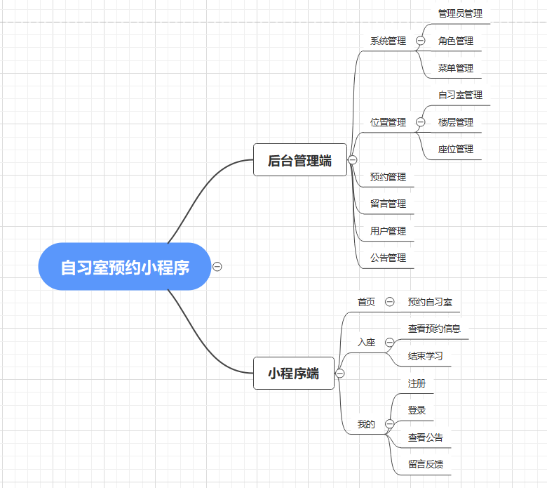
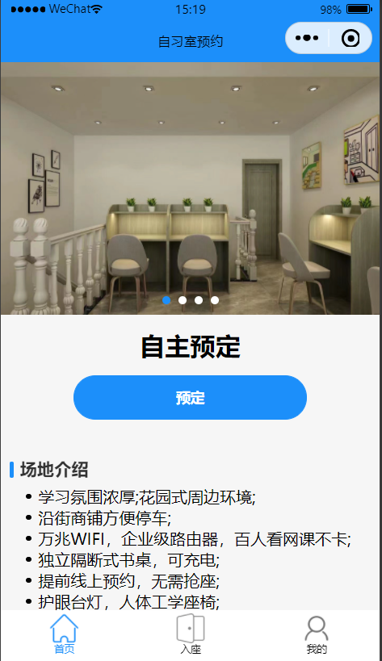
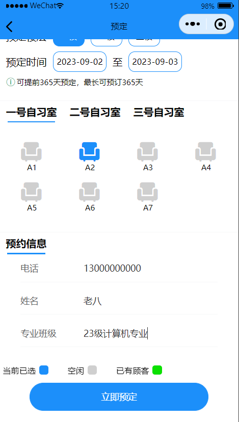
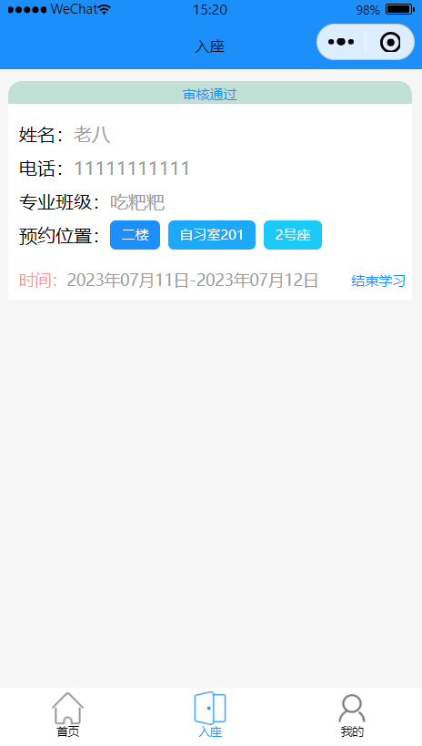
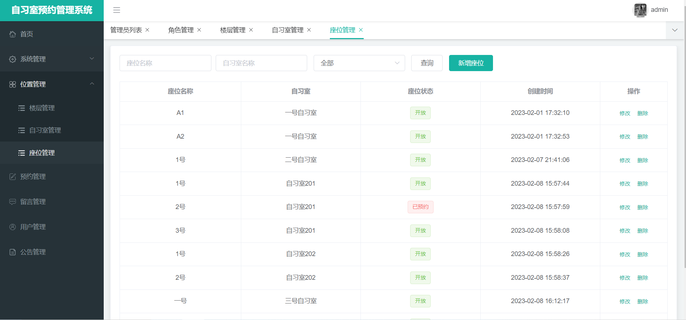
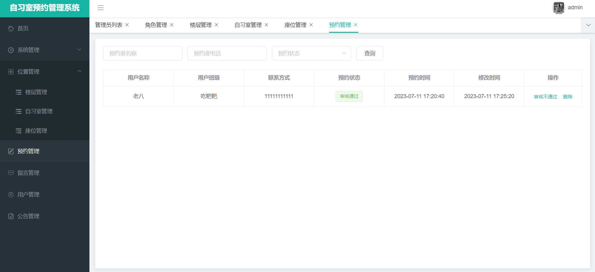
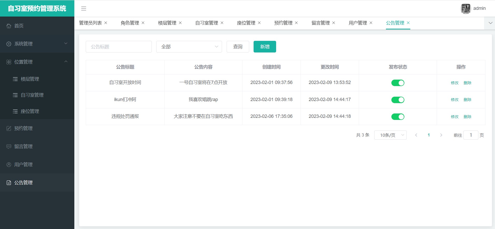
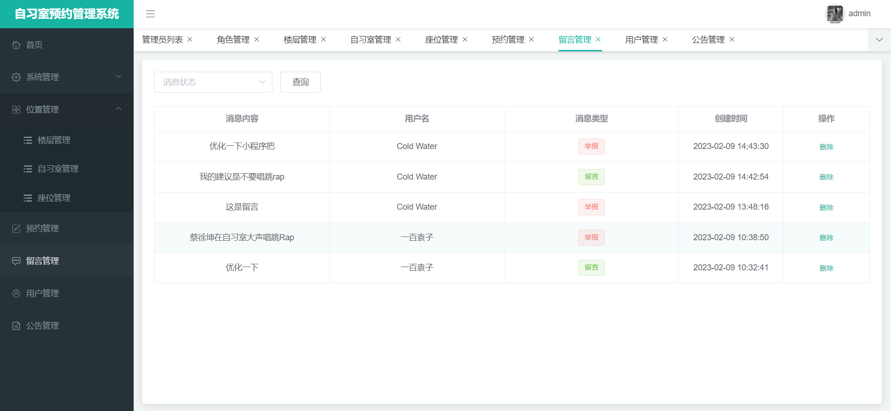

# 自习室预约小程序 

（源代码+12000字文档+ppt）

## 项目简介

自习室预约小程序分为小程序端和后端管理端。 
小程序端使用微信小程序原生开发。 
后台管理端是前后端分离的系统，前端使用vue+elementui，后端使用springboot框架。数据库使用的是mysql数据库。 
在本系统中，用户可以在小程序端进行自习室座位预约，管理员可以在后台管理端进行审核等操作。 
该系统功能完善，界面美观，非常适合作为毕设或者课程作业以及新手开发学习。 

## 功能介绍
 

## 技术服务

## 系统图片
#### 1.小程序首页
 
#### 2.座位预约
 
#### 3.查看预约详情
 
#### 4.小程序我的页面
 
#### 5.后台管理端登录页
 
#### 6.座位管理
 
#### 7.预约管理
 
#### 8.公告管理
 
#### 9.留言管理
 
